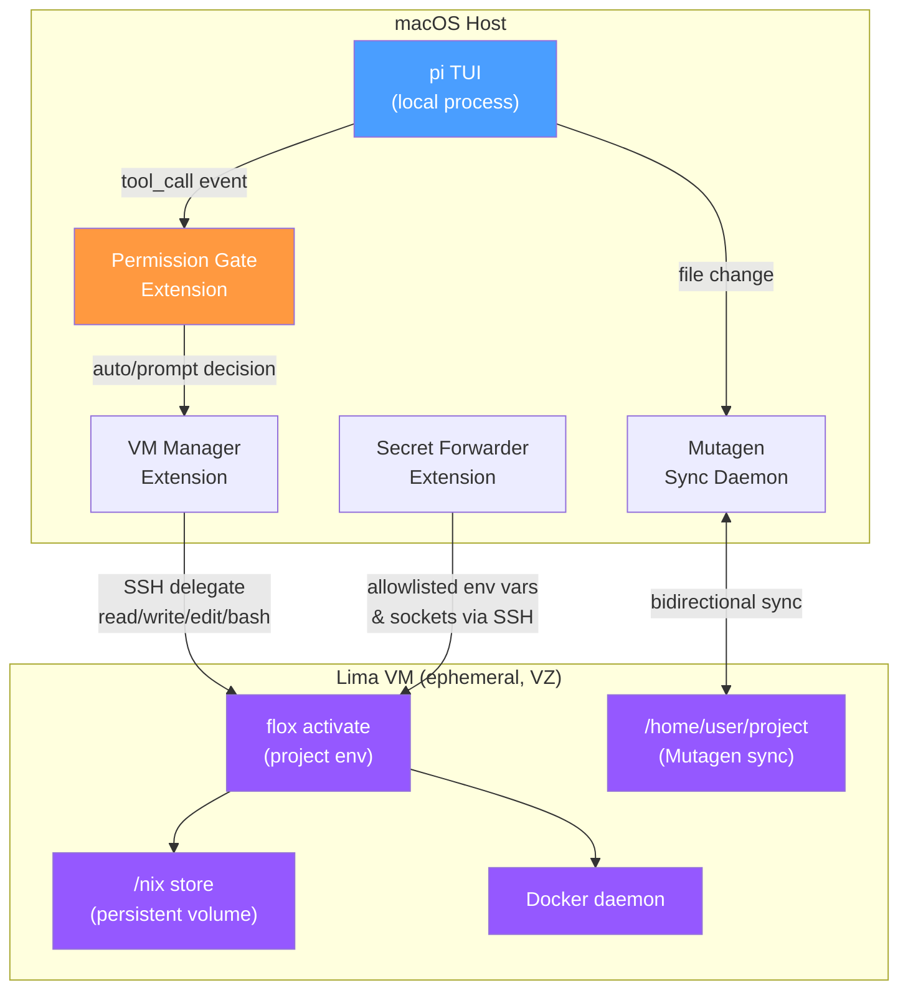

# Pi Sandboxing Design — VM-Based Isolation with Permission Gating

**Date:** 2026-05-01  
**Status:** Draft  
**Approach:** Approach 1 (SSH Delegation + Lima VM + Mutagen), with Approach 2 (sandbox-runtime) as a future layer

---

## Problem

The pi coding agent runs with full system access on the laptop. We need defense in depth against two threat models:

1. **Agent goes rogue** — the LLM makes unwanted changes, exfiltrates secrets, or accesses the network
2. **Untrusted code execution** — the agent installs or runs code that is malicious (e.g., a bad npm package)

## Architecture Overview



**Three extensions, one concern each:**

1. **VM Manager** — Lifecycle (boot, provision, teardown) and SSH transport. Replaces built-in tool backends with SSH-delegated versions when a VM is running.
2. **Permission Gate** — Classifies commands as RO (auto-run) or mutative (prompts user). Operates on `tool_call` events before execution.
3. **Secret Forwarder** — Allowlists specific env vars, sockets, files, and ports to forward into the VM. Default is zero access.

**External components:**

- **Mutagen** — Bidirectional file sync between laptop and VM. Started/stopped by VM Manager as part of lifecycle.
- **Lima** — VM management (create, start, stop, delete). VZ hypervisor on Apple Silicon.
- **Flox** — Package and environment manager inside the VM. Provides project tooling via `.flox/env/manifest.toml`.

---

## Extension 1: VM Manager

### Lifecycle

```
pi start
  │
  ├─► Check if pi-vm exists & running (limactl list)
  │   ├─► Yes → reuse, skip boot
  │   └─► No → boot sequence:
  │       ├─► limactl start --name=pi-vm lima-vm.yaml
  │       ├─► Wait for SSH ready (limactl shell pi-vm echo ok)
  │       ├─► Start Mutagen sync session (laptop ↔ VM)
  │       └─► flox activate inside VM (or verify activation)
  │
  ├─► Tool calls delegate via SSH throughout session
  │
  └─► pi quit
      ├─► Stop Mutagen sync
      └─► limactl delete pi-vm (ephemeral — throw away)
```

- The VM has no persistent disk except the `/nix` volume. All other state is ephemeral.
- The project directory lives on the laptop and syncs bidirectionally via Mutagen.
- VM Manager hooks `session_start` and `session_shutdown` for lifecycle.
- Replaces `read`/`write`/`edit`/`bash` tools with SSH-delegated versions using `createReadTool`/`createWriteTool`/`createEditTool`/`createBashTool` factory functions (following pi's `ssh.ts` example pattern).
- A `--no-vm` flag or `/vm` command toggles between local and VM execution so pi still works without the VM when desired. When `--no-vm` is active, tools run locally with no sandboxing — the VM Manager simply delegates to the default local tool backends. (Future: when sandbox-runtime is layered in, `--no-vm` could still apply in-VM process sandboxing.)

### SSH Transport

- Uses `limactl shell pi-vm` under the hood (handles SSH config, keys, and port mapping).
- For tool operations that need streaming (bash), spawns SSH processes with proper signal/timeout handling.
- The Secret Forwarder and Port Forwarding add SSH arguments (`-R`, `-L`, `SendEnv`) to the connection.

### Lima VM Template

```yaml
# ~/.pi/agent/vm/lima-vm.yaml
vmType: vz
arch: aarch64
cpus: 4
memory: 8GiB
disk: 50GiB

images:
  - location: "https://cloud-images.ubuntu.com/releases/24.04/release/ubuntu-24.04-minimal-cloudimg-arm64.img"
    arch: aarch64

mounts:
  - location: "~/.pi/agent/vm/nix-store"
    mountPoint: "/nix"
    writable: true

provision:
  - mode: system
    script: |
      # Install Flox
      sh <(curl -L https://flox.dev/install)
      # Install Docker
      apt-get update && apt-get install -y docker.io
      systemctl enable docker
      usermod -aG docker user
```

- **VZ hypervisor** — native Apple Silicon virtualization, fast boot (~15s cold, ~6s warm).
- **Ubuntu Minimal** — small image, broad compatibility, apt as fallback.
- **Persistent nix volume** — `~/.pi/agent/vm/nix-store` maps to `/nix` inside VM. Linux binaries only. Persists across VM recreations for warm cache.
- **Docker inside VM** — not forwarded from laptop. kind, tilt, and container workloads run inside the VM.

### Boot Timing Targets

| Step | Cold (s) | Warm (s) |
|------|----------|----------|
| Lima create + boot | 5-8 | 2-3 |
| SSH ready check | 1-2 | 1-2 |
| Flox activate | 1 | 1 |
| Mutagen initial sync | 3-5 | 1 |
| Port forward setup | 1 | 1 |
| **Total** | **11-17** | **5-7** |

### User Bash Commands

The VM Manager also hooks `user_bash` events to delegate `!` and `!!` commands via SSH, following the same pattern as the ssh.ts example.

---

## Extension 2: Permission Gate

### Classification Logic

Intercepts `tool_call` events and classifies each invocation as **auto** (run without prompting) or **prompt** (ask the user first).

1. **`read`, `ls`, `grep`, `find`** → always auto (inherently read-only)
2. **`write`, `edit`** → always prompt (files are being mutated)
3. **`bash`** → pattern matching (glob syntax: `*` matches any chars, `?` matches one char):
   - Check `autoPatterns` first — if any pattern matches → auto
   - Then check `promptPatterns` — if any pattern matches → prompt
   - If neither matches → **prompt by default** (deny-by-default for unknowns)

### Config Structure

Merged from global + project-local. Project patterns are **unioned** with global patterns (additive, can't remove global restrictions).

**Global** (`~/.pi/agent/extensions/permission-gate.json`):
```json
{
  "enabled": true,
  "rules": {
    "bash": {
      "autoPatterns": [
        "git status*",
        "git log*",
        "git diff*",
        "git branch*",
        "kubectl get *",
        "kubectl describe *",
        "kubectl logs *",
        "rg *",
        "fd *",
        "cat *",
        "ls *",
        "find *",
        "head *",
        "tail *",
        "wc *",
        "file *",
        "which *",
        "flox list*"
      ],
      "promptPatterns": [
        "kubectl apply *",
        "kubectl delete *",
        "kubectl patch *",
        "kubectl create *",
        "git push*",
        "rm *",
        "sudo *"
      ]
    },
    "write": { "mode": "prompt" },
    "edit": { "mode": "prompt" }
  }
}
```

**Project-local** (`.pi/permission-gate.json`):
```json
{
  "rules": {
    "bash": {
      "autoPatterns": [
        "helm template *",
        "helm list*"
      ]
    }
  }
}
```

### Prompt UX

When a mutative command needs approval, shows exact patterns so the user knows what they're allowing:

```
⚠️ Mutative command:

  kubectl apply -f deployment.yaml

  Allow?
  → Yes (this time only)
    Yes (always allow: kubectl apply -f deployment.yaml)
    Yes (always allow: kubectl apply *)
    No
```

Each option shows exactly what would be added to the allowlist:
- **This time only** — one-shot, nothing saved
- **Always allow the exact command** — literal string match
- **Always allow the pattern** — the matched promptPattern (only offered if a pattern matched)

If a command doesn't match any existing pattern (deny-by-default case):

```
⚠️ Unknown mutative command:

  kubectl rollout restart deployment/api

  Allow?
  → Yes (this time only)
    Yes (always allow: kubectl rollout restart deployment/api)
    No
```

No broad pattern offered for unrecognized commands — broad patterns must be added manually to the config.

### Interaction with VM Manager

Permission Gate runs **before** VM Manager's SSH delegation. Event order:
1. `tool_call` fires → Permission Gate classifies → may prompt user
2. If allowed through → VM Manager's tool backend executes via SSH

---

## Extension 3: Secret Forwarder

### Principle

Nothing leaves the laptop unless explicitly listed. No env vars, no sockets, no files, no ports are forwarded by default.

### Config Structure

**Global only** (`~/.pi/agent/extensions/secret-forwarder.json`) — no project-local overrides, to prevent a compromised project from granting itself access:

```json
{
  "envVars": [
    "KUBECONFIG",
    "AWS_PROFILE"
  ],
  "sockets": [
    "/run/docker.sock",
    "~/.ssh/agent.sock"
  ],
  "files": [
    "~/.kube/config"
  ],
  "forwardPorts": {
    "auto": true,
    "static": [
      { "from": 8080, "label": "OIDC callback" },
      { "from": 9000, "label": "gcloud auth" }
    ],
    "ranges": [
      { "start": 3000, "end": 3100, "label": "dev servers" },
      { "start": 4000, "end": 4100, "label": "debuggers" }
    ]
  }
}
```

### How Each Resource Is Forwarded

- **env vars**: Injected into SSH sessions via `SendEnv` or inline `VAR=value command`. Only the named vars are sent — values read from host at execution time, never stored.
- **sockets**: Forwarded via SSH `-R` (remote forwarding). The VM connects *through* the laptop, not the other way around.
- **files**: Copied into the VM via `scp`/`ssh` before the first tool call (in `session_start` hook).
- **static ports**: Forwarded immediately via SSH `-L` when the VM boots.
- **port ranges**: Not all forwarded at once. VM Manager watches for processes in the VM listening on ports in declared ranges and adds forwarding dynamically.

### Security Properties

- Default is zero access — empty config means nothing is forwarded
- Values are never logged or stored — injected at runtime
- Socket forwarding is directional: VM connects through the laptop
- The agent cannot discover what's available on the laptop beyond what's explicitly listed
- Project-local overrides are not supported for secrets

---

## Port Forwarding (Part of Secret Forwarder)

### OIDC / Browser Auth Flow

When the agent runs a command in the VM that needs browser authentication:

1. Agent runs `kubectl oidc-login` (or similar) in the VM
2. URL appears in bash output → VM Manager detects URL pattern → surfaces to user via `ctx.ui.notify()`:

```
🔗 Browser auth URL detected:

  https://accounts.google.com/o/oauth2/auth?client_id=...

  [Open in browser]  [Copy to clipboard]  [Skip]
```

3. User authenticates in laptop browser
4. Browser redirects to `localhost:PORT/callback` → if port is forwarded via config, callback lands in VM automatically
5. Token stored in VM session — no secrets on disk

### Dynamic Port Forwarding

With `auto: true`, the VM Manager watches bash output and process listings for new port listeners:

```
🔌 New listener in VM:

  http://localhost:3456 (tilt — detected from process args)

  Forward to laptop?
  → Yes (this port)
    Yes (always forward ports from tilt)
    No
```

"Yes (always forward ports from tilt)" adds a process-name pattern to the config so future ports from the same tool auto-forward.

### Developer Workflows

For kind, tilt, and dev servers:
- Docker runs inside the VM (not forwarded from laptop — that would be a security hole)
- kind creates clusters inside the VM's Docker
- kubectl accesses the cluster via forwarded `KUBECONFIG`
- Dev server ports (3000+, 4000+, 8080) auto-forward for browser access on laptop

---

## File Sync — Mutagen Bidirectional

```
Laptop                           Lima VM
~/src/my-project/  ←→ Mutagen ↔  /home/user/project/
```

### Lifecycle

- **Session start**: VM Manager starts a Mutagen sync session after VM boot
- **During session**: Mutagen watches both sides, syncs within ~1s
- **Session end**: VM Manager stops the sync session before VM teardown

### The Read/Write Path

Two channels serve different purposes:

- **Agent reads/writes** → via SSH-delegated tool calls directly against the VM filesystem. Mutagen then syncs agent's changes back to the laptop.
- **User reads/writes** → on the laptop filesystem. Mutagen syncs to the VM so the agent sees changes.
- **Agent reads** → always via SSH to the VM (always up-to-date thanks to Mutagen).

Mutagen's job is keeping the laptop copy in sync for the user's benefit. The agent never reads from or writes to the laptop directly.

### Conflict Resolution

When Mutagen can't auto-resolve (same file edited on both sides simultaneously):

```
⚠️ Sync conflict:

  src/app.ts — both sides modified

  → Keep laptop version (remote changes lost)
    Keep VM version (laptop changes lost)
    Show both versions (manual resolution)
```

Conflicts should be rare in practice — user edits on laptop, agent edits in VM.

### Initial Sync

On first connection to an empty VM, initial sync is one-directional (laptop → VM). After that, bidirectional.

---

## Flox Environment in the VM

### How It Works

1. **Project manifest defines tools** — `.flox/env/manifest.toml` (synced via Mutagen) lists kubectl, rg, fd, kind, tilt, etc.
2. **`flox activate`** runs as part of SSH shell setup — every command the agent runs is inside an activated environment.
3. **Agent installs new tools** — `flox install <package>` inside the VM updates the manifest, which Mutagen syncs back to the laptop for review.
4. **Persistent `/nix` store** — a Lima volume that maps `~/.pi/agent/vm/nix-store` to `/nix` inside the VM. This is a Linux-native store (not shared with macOS). Persists across VM recreations for a warm cache.
5. **Reconnection** — existing VM with Flox env just re-activates. New VM uses the manifest to rebuild from cached nix store.

### Security Property

`flox install` only modifies `.flox/env/manifest.toml`. It cannot modify system-level packages or affect the laptop's nix store. New packages are explicit in the manifest for user review.

---

## Config Merge Strategy

| Extension | Global Config | Project Config | Merge Rule |
|---|---|---|---|
| VM Manager | `~/.pi/agent/extensions/vm-manager.json` | `.pi/vm-manager.json` | Deep merge (project overrides global) |
| Permission Gate | `~/.pi/agent/extensions/permission-gate.json` | `.pi/permission-gate.json` | Union (project adds patterns, can't remove global restrictions) |
| Secret Forwarder | `~/.pi/agent/extensions/secret-forwarder.json` | *(none)* | No project-level overrides |

---

## Future: Approach 2 (Sandbox Runtime Layer)

The `@anthropic-ai/sandbox-runtime` package provides OS-level process sandboxing (`sandbox-exec` on macOS, `bwrap` on Linux). This can be added as an additional layer inside the VM for defense in depth:

- Even inside the VM, the agent's bash commands could be wrapped with sandbox-exec/bwrap
- Network allowlisting and filesystem restrictions apply within the VM, further limiting blast radius
- This provides process-level isolation *within* the VM, so a compromised agent can't pivot to the VM's root filesystem or network

This is a future enhancement — the VM isolation alone provides strong defense, and the sandbox runtime can be layered in later through the existing `sandbox/` extension pattern.

---

## Dependencies

| Dependency | Purpose | Install |
|---|---|---|
| Lima | VM lifecycle management | Already installed |
| QEMU/VZ | Hypervisor | Already installed (using VZ) |
| Mutagen | Bidirectional file sync | Not yet installed (nix package available) |
| Flox | Package/environment management in VM | Already installed |
| `@anthropic-ai/sandbox-runtime` | Future: in-VM process sandboxing | npm package |